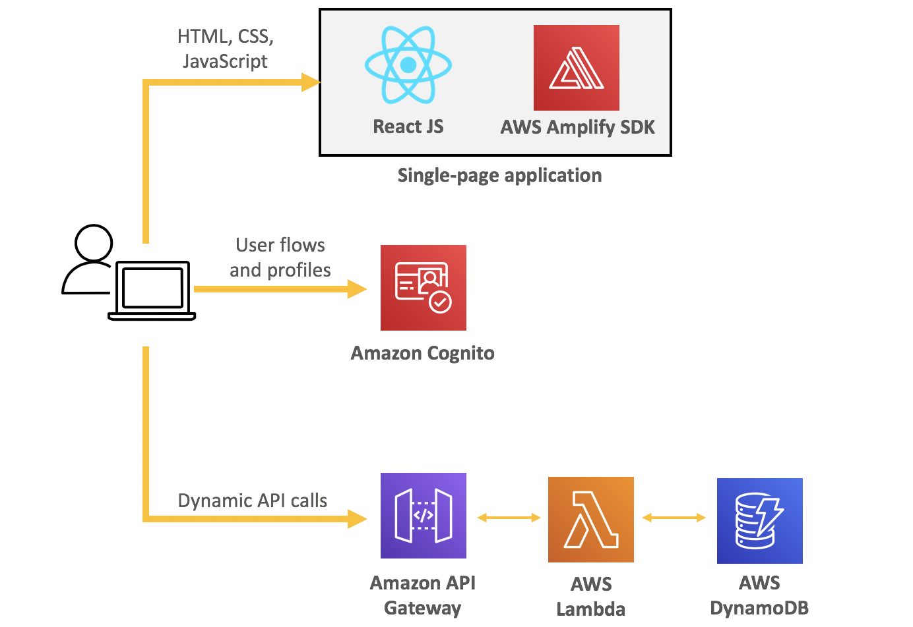

# User Management Serverless
Build a React User Management app use AWS Cognito, Amplify, API Gateway, Lambda, DynamoDB and more.

## Architecture


## Requirements
- AWS credentials
- AWS CLI
- Amplify CLI
- Serverless CLI

## Notes

### Cognito get user token

*Make sure that `Generate client secret` is unchecked when create new Cognito app client*

```
aws cognito-idp initiate-auth --auth-flow USER_PASSWORD_AUTH --client-id client_id --auth-parameters USERNAME=testuser@domain.com,PASSWORD=password
```

If the `ChallengeName` is `NEW_PASSWORD_REQUIRED`, we need to change the `Temporary password`:

```
aws cognito-idp admin-respond-to-auth-challenge --user-pool-id user_pool_id --client-id client_id --challenge-name NEW_PASSWORD_REQUIRED --challenge-responses NEW_PASSWORD=new_password,USERNAME=testuser@domain.com --session session_in_previous_response
```